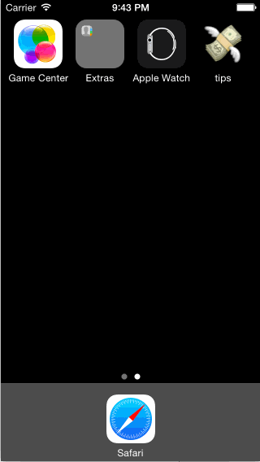

# Tip Calculator for CodePath

This is the Tip Calculator for the CodePath application. See the tutorial video for how to make your own [Tip Calculator in Swift](https://vimeo.com/102084767). Apply for the iOS for Designers CodePath course here: http://codepath.com/iosfordesigners.

+ Time Spent: 3.5 hours

## Completed User Stories
+ *[x] Required: Simple calculator functionality
+ *[x] Optional: Custom fonts
+ *[x] Optional: Change colors
+ *[x] Optional: Splash screen and icon
+ *[x] Optional: Animated an emoji transition from splash to main view
+ *[x] Optional: Split bill with friends
+ *[x] Optional: Changed keyboard to dark
+ *[x] Optional: Set keyboard to be in focus on load (becomeFirstResponder)

## Walkthrough of user stories

GIF created with [LiceCap](http://www.cockos.com/licecap/).
